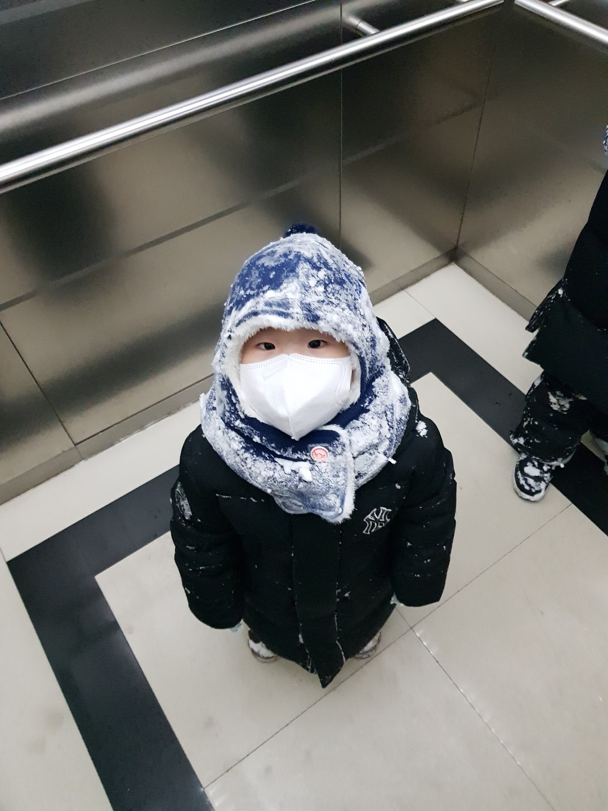

**Intro 소개**

한양대학교 정보시스템학과 원영준 교수 ([Young-CV](https://www.dropbox.com/s/uxqsad4xfnbjr2w/cv-young-1pg.pdf?dl=0)) 

\#youngjoon@hanyang.ac.kr \#02-2220-2388 \#[Linkedin](https://www.linkedin.com/in/yjwon)  #[블로그](https://dev.to/youngjoonwon)

I am a faculty member at [Hanyang University](http://www.hanyang.ac.kr/english) in the College of Engineering, Department of Information Systems. Before joining Hanyang University, I was a Researcher at [IIJ Research Lab](https://www.iij-ii.co.jp/en/members/index.html), Tokyo, Japan (Internet Initiative Japan, Director: Kenjiro Cho). Prior to IIJ, I was a Postdoctoral Researcher at [INRIA](http://www.inria.fr/), Bordeaux, France (Advisors: Olivier Beaumont, Lionel Eyraud-Dubois). I received B.Math, Computer Science at the [University of Waterloo](http://www.uwaterloo.ca/), Canada, and PhD at [POSTECH](http://www.postech.ac.kr/), Korea (Supervisor: James Hong).

- 2012.3 - present: Associate Professor, Hanyang University, Seoul, Korea
- 2011 - 2012: Researcher, Internet Initiative Japan, Tokyo, Japan.
- 2010 - 2011: Postdoctoral Researcher, INRIA, Bordeaux, France
- 2010: PhD, Computer Science & Engineering, POSTECH, Korea
- 2005: Visiting Researcher, University of Waterloo (Bell Network Lab), Waterloo, ON, Canada
- 2003: B. Mathematics, Computer Science, University of Waterloo, Waterloo, ON, Canada
- 1999: New Westminster Secondary, New Westminster, BC, Canada

**Projects 프로젝트**

1. “블록체인 거래 모니터링 시스템 연구 Blockchain transaction monitoring system”, funded by IITP, Ministry of Science and ICT, 2018.04-2020.12. 과학기술정보통신부 (연구참여).
2. “네트워크 장비 보안 식별 및 보안기능 설정 점검 방안 연구”, funded by National Security Research Institute (NSR), 2019.4-2019.10. 국가보안기술연구소.
3. “제어시스템 사이버 공격 대응 기술 동향 분석 연구 Cyber attack defense techniques for control networks: SCADA and etc.”, funded by NSR, 2018.4-2018.10. 국가보안기술연구소.
4. (no funding) "3G/4G LTE/Wi-Fi 통신망 품질측정 빅데이터 분석연구" 2017-2018, 한국정보화진흥원 (NIA).
5. “제어망 내부 트래픽 수집 기술 고도화 및 점검 기술 연구 High speed packet capture and diagnosis techniques for control network traffic, using portable single-board computers”, funded by NSR, 2017.4-2017.10. 국가보안기술연구소.
6. “제어시스템 네트워크 이상징후 비실시간 탐지 알고리듬 연구 Industrial control systems security; abnormal traffic detection algorithm in SCADA”, funded by NSR, 2016.4 - 2016.10. 국가보안기술연구소.
7. “안전한 사회를 위한 의료정보융합시스템 연구 Secure eHealth information sharing convergence system for safer society”, funded by Ministry of Education, 2014.11- 2017.04. 기초연구.
8. “Research on private SNS information sharing system: security issues”, funded by NSR, 2014.08 - 2014.11. Private SNS 정보공유시스템 연구, 국가보안기술연구소.
9. “인터넷 비정상 탐지 기법 연구 Research on Internet anomaly detection techniques”, funded by Korea Internet & Security Agency, 2014.07 - 08. 한국인터넷진흥원 (KISA).
10. “Trending time series signals of traffic anomaly”, funded by Hanyang Univ, 2012.04.01 - 2013.03.01.
11. (no funding) Packet over transport networks; Future traffic forecast models, Korea Telecom, 2013.
12. “Internet measurement data-sharing cloud platform to characterize traffic trends”, funded by Japan Society of Promotional Science, 2011.04.01 - 2013.03.31 (ended at 2012.03.01).

**자문 및 학회활동**

1. Reviewer (2020~) for IEEE ICBC, APNOMS and etc.
2. 2017년 통신서비스 품질평가 보고서 자문, 한국정보화진흥원

**Publications 논문**            [dblp-1](http://dblp.uni-trier.de/pers/hd/w/Won:Youngjoon) [dblp-2](http://dblp.uni-trier.de/pers/hd/w/Won:Young_J=)

1. J. Hyun, Youngjoon Won, Kenjiro Cho, Romain Fontugne, et al., “High-end LTE Service Evolution in Korea: 4 Years of Nationwide Mobile Network Measurements”, IEEE/IFIP CNSM, Tokyo, Japan, Nov. 2017.
2. J. Hyun, Youngjoon Won, et al., “Measuring Auto Switch Between Wi-Fi and Mobile Data Networks in an Urban Area” (short), CNSM, Nov. 2016.
3. J. Hyun, Youngjoon Won, et al., “Measurement and Analysis of Application-level Crowd Sourced LTE and LTE-A Networks”, IEEE NetSoft, June 2016.
4. J. Hyun, Youngjoon Won, et al., “Is LTE-Advanced Really Advanced?” (short), IEEE/IFIP NOMS, April 2016.
5. (SCIE) TBA, JISE. (accepted)
6. (SCI) J. Chung, Youngjoon Won, et al., “[Mass-Count Disparity in Mobile Traffic](http://young.hanyang.ac.kr/pub/2016.ieee.comm.pdf)”, IEEE Communications Letters, Vol. 20, Issue 1, Jan. 2016. (IF: 1.34) [site](http://ieeexplore.ieee.org/document/7312899/)
7. (SCIE) W. Hwang, H. Lee, S. Kim, Youngjoon Won, M. Lee, “Efficient Recommendation Methods Using Category Experts for a Large Dataset”, Information Fusion, Vol. 28, March 2016, pp. 75-82. (IF: 3.681, Elsevier)
8. (SCI) S. Yoon, J. Park, J. Choi, Youngjoon Won, M. Kim, “Http Traffic Classification based on Hierarchical Signature Structure”, IEICE Trans. on Information and Systems Letter, Vol.E98-D, No. 11, Nov. 2015.
9. (SCIE) J. Park, S. Yoon, Youngjoon Won, M. Kim, “A Lightweight Software Model for Signature-Based Application-Level Traffic Classification System”, IEICE Transactions on Information and Systems, Vol. E97-D, No. 10, Oct. 2014, pp. 2697-2705.
10. B. Bae, J. Lee, S. Kim, Youngjoon Won, Y. Park, “Analyzing Network Privacy Preserving Methods: A Perspective of Social Network Characteristics”, ACM SAC, March 2014 (short).
11. (SCIE) B. Park, Youngjoon Won, et al., “Fine-grained Traffic Classification Based on Functional Separation”, International Journal of Network Management (IJNM), Vol 23, Issue 5, Sept/Oct 2013, pp. 350-381.
12. Youngjoon Won, Romain Fontugne, Kenjiro Cho, Hiroshi Esaki, Kensuke Fukuda, “[Nine Years of Observing Traffic Anomalies: Trending Analysis in Backbone Networks](http://young.hanyang.ac.kr/pub/2013.im.pdf)”, IEEE/IFIP International Symposium on Integrated Network Management mini-conf,  Ghent, Belgium, May 27-31, 2013. [site](http://ieeexplore.ieee.org/abstract/document/6573044/)
13. (SCIE) Youngjoon Won, et al., “[An Approach for Failure Recognition in IP-based Industrial Control Networks and Systems](http://young.hanyang.ac.kr/pub/2012.ijnm.pdf)”, IJNM, Vol. 22, Issue 6, Dec. 2012, pp. 477-493.
14. Romain Fontugne, Youngjoon Won, Kensuke Fukuda, Kenjiro Cho, “Disasters seen through Flickr cameras”, ACM CoNEXT Workshop on the Internet and Disaster, Tokyo, Japan, Dec. 6, 2011.
15. Kenjiro Cho, Cristel Pelsser, Randy Bush, Youngjoon Won, “[The Japan Earthquake: the impact on traffic and routing observed by a local ISP](http://young.hanyang.ac.kr/pub/2011.swid.pdf)”, ACM CoNEXT Workshop on the Internet and Disaster, Tokyo, Japan, Dec. 6, 2011. [site](http://dl.acm.org/citation.cfm?id=2079362)
16. (SCIE) S. Pandey, Young J. Won, James Hong, John Strassner, “Dimensioning Internet Protocol Television Video on Demand Services”, International Journal of Network Management, Vol. 21, Issue 6, Nov. 2011, pp.455-468. (IF: 0.222, ISBN: 1055-7148, Wiley-Blackwell)
17. S. Seo, Young J. Won, James Hong, “Witnessing Distributed Denial-of-Service Traffic from an Attacker’s Network”, Int. Conf. Network and Service Management (CNSM), Paris, France, Oct. 24-28, 2011, pp. 1-7. [site](http://ieeexplore.ieee.org/xpls/abs_all.jsp?arnumber=6103957&tag=1)
18. (SCI) B. Park, Youngjoon Won, and James Hong, “Toward Fine-grained Traffic Classification”, IEEE Communications Magazine, Vol. 49, No. 7, July 2011, pp. 104-111. (IF: 3.875, ISBN: 0163-6804) [site](http://ieeexplore.ieee.org/xpls/abs_all.jsp?arnumber=5936162)
19. Olivier Beaumont, Lionel Eyraud-Dubois, Young J. Won, “[Using the Last-mile Model as a Distributed Scheme for Available Bandwidth Prediction](http://hal.inria.fr/inria-00588651/PDF/EuroPar2011.pdf)”, International Conference on Parallel Processing (Euro-Par), LNCS 6852, Bordeaux, France, Aug. 29, 2011, pp. 103-116. (ISBN: 978-3-642-23399-9) [site](http://dl.acm.org/citation.cfm?id=2033358)
20. (SCIE) S. Pandey, M.J. Choi, Young J. Won, James Hong, “SNMP-based Enterprise IP Network Topology Discovery”, International Journal of Network Management, Vol. 21, Issue 3, May 11, 2011, pp. 169-184. (IF: 0.222, ISBN: 1055-7148, Wiley-Blackwell) [site](http://dl.acm.org/citation.cfm?id=2000225)
21. J. Chung, B. Park, Young J. Won, John Strassner, James Hong, “An Effective Similarity Metric for Application Traffic Classification”, IEEE Network Operations and Management Symposium (NOMS), Osaka, Japan, April 19-23, 2010, pp. 286-292. [site](http://ieeexplore.ieee.org/xpl/articleDetails.jsp?arnumber=5488477)
22. S. Kim, Young J. Won, John Strassner, James Hong, “Manageability of the Internet: Management with New Functionality”, IEEE Network Operations and Management Symposium (NOMS), Osaka, Japan, April 19-23, 2010, pp. 837-840. [site](http://ieeexplore.ieee.org/xpls/abs_all.jsp?arnumber=5488361)
23. J. Chung, B. Park, Young J. Won, John Strassner, James Hong, “Traffic Classification Based on Flow Similarity”, IEEE Int. Workshop on IP Operations and Management (IPOM), LNCS 5843, Venice, Italy, Oct. 29-30, 2009, pp. 65-77. [site](http://dl.acm.org/citation.cfm?id=1692727)
24. S. Pandey, Young J. Won, H. Ju, James Hong, “Dimensioning of IPTV VoD Service in Heterogeneous Broadband Access Networks”, APNOMS, LNCS 5787, Jeju, Korea, Sept. 23-25, 2009, pp. 418-422. [site](http://dl.acm.org/citation.cfm?id=1814056)
25. S.S. Kim, Young J. Won, M. Choi, James Hong, John Strassner, “Towards Management of the Future Internet”, IEEE/IFIP Workshop on Management of the Future Internet, New York, USA, June 5, 2009, pp. 1-6.
26. B. Park, Young J. Won, H. Yu, James Hong, H. Noh, J. Lee, “Fault Detection in IP-based Process Control Networks using Data Mining”, IEEE/IFIP Integrated Network Management, New York, USA, June 1-5, 2009, pp. 211-217. [site](http://ieeexplore.ieee.org/xpls/abs_all.jsp?arnumber=5188812)
27. (SCI) Young J. Won, M. Choi, James Hong, C. Hwang, J. Yoo, “[Measurement of Download and Play and Streaming IPTV Traffic](http://young.hanyang.ac.kr/pub/2008.commag.pdf)”, IEEE Communications Magazine, Vol. 46, No. 10, October 2008, pp. 154-161.
    (IF: 2.799, ISBN: 0163-6804) [site](http://dl.acm.org/citation.cfm?id=2293939)
28. (SCI) Young J. Won, M. Choi, James Hong, M. Kim, H. Hwang, J. Lee, S. Lee, “Fault Detection and Diagnosis in IP-based Mission Critical Industrial Process Control Networks”, IEEE Communications Magazine, Vol. 46, No. 5, May 2008, pp. 172-180. (IF: 2.799, ISBN: 0163-6804) [site](http://dl.acm.org/citation.cfm?id=2293821)
29. B. Park, Young J. Won, M. Choi, M. Kim, James Hong, “Empirical Analysis of Application-level Traffic classification using Supervised Machine Learning”, APNOMS, LNCS 5297, Beijing, China, Oct. 2008, pp. 474-477. [site](http://portal.acm.org/citation.cfm?id=1482474)
30. Young J. Won, B. Park, M. Choi, James Hong, H. Lee, C. Hwang, J. Yoo, “End-User IPTV Traffic Measurement of Residential Broadband Access Networks”, IEEE Int. Workshop on End-to-End Monitoring Techniques and Services, Salvador, Brazil, April 7, 2008, pp. 95-100. [site](http://ieeexplore.ieee.org/xpls/abs_all.jsp?arnumber=4509934)
31. B. Park, Young J. Won, M. Kim, James Hong, “[Towards Automated Application Signature Generation for Traffic Identification](http://young.hanyang.ac.kr/pub/2008.noms.pdf)”, IEEE Network Operations and Management Symposium (NOMS), Salvador, Brazil, April 7-11, 2008, pp. 160-167. [site](http://ieeexplore.ieee.org/xpls/abs_all.jsp?arnumber=4575130)
32. Young J. Won, M. Choi, J. Lee, J. Lee, H. Hwang, James Hong, “Detecting Network Faults on Industrial Process Control IP Networks”, IEEE Int. Conference on IP Operations and Management (IPOM), LNCS 4786, San Jose, CA, USA, Oct. 31-Nov. 2, 2007, pp. 184-187. [site](http://dl.acm.org/citation.cfm?id=1775344)
33. Young J. Won, M. Choi, M. Kim, H. Noh, J. Lee, H. Hwang, James Hong, “Measurement Analysis of IP-Based Process Control Networks”, APNOMS, LNCS 4773, Sapporo, Hokkaido, Japan, Oct. 10-12, 2007, pp. 385-394. [site](http://link.springer.com/chapter/10.1007/978-3-540-75476-3_39?null)
34. Young J. Won, B. Park, S. Hong, K. Jung, H. Ju, James Hong, “Measurement Analysis of Mobile Data Networks”, Passive and Active Measurement Conference (PAM), LNCS 4427, Louvain-la-neuve, Belgium, April 5-6, 2007, pp. 223-227. [site](http://portal.acm.org/citation.cfm?id=1762919)
35. (SCIE) M. Kim, Young J. Won, James Hong, “Characteristic Analysis of Internet Traffic from the Perspective of Flows”, Journal of Computer Communications, Vol. 29, Issue 10, June 19 2006, pp. 1639-1652. (IF:0.444) [site](http://dl.acm.org/citation.cfm?id=1647080)
36. Young J. Won, B. Park, H. Ju, M. Kim, James Hong, “A Hybrid Approach for Accurate Application Traffic Identification”, IEEE Int. Workshop on End-to-End Monitoring Techniques and Services, Vancouver, Canada, April 3, 2006, pp. 1-8. [site](http://dx.doi.org/10.1109/E2EMON.2006.1651273)
37. (SCI) M. Kim, Young J. Won, James Hong, “Application-Level Traffic Monitoring and Analysis on IP Networks”, ETRI Journal, Vol.27, No.1, Feb. 2005, pp.22-42. (IF: 1.254) [site](http://citeseerx.ist.psu.edu/viewdoc/summary?doi=10.1.1.109.5322)
38. S. Chung, Young J. Won, D. Agrawal, S. Hong, Kihong Park, “Detection and Analysis of Packet Loss on Underutilized Enterprise Network Links”, IEEE Int. Workshop on End-to-End Monitoring Techniques and Services, Nice, France, May 15, 2005, pp. 164-176. [site](http://dl.acm.org/citation.cfm?id=1253227)
39. M. Kim, Young J. Won, H. Lee, James Hong, Raouf Boutaba, “Flow-based Characteristic Analysis of Internet Application Traffic”, IEEE Int. Workshop on End-to-End Monitoring Techniques and Services, San Diego, California, USA, October 3, 2004, pp. 62-67.

**Patents 특허**

1. “Autonomic Network Management System” US Reg #: US 9019817 B2,  2015.
2. “Autonomic Network Management System” Europe Reg #: EP2530872, 2015.
3. “Signature Generation Apparatus for Network Behavior of Applications, Collection Server, Detection System for Network Behavior, and Signature Generation Method for Network Behavior” Registration #: 10-1148705 KR, May 15, 2012.
4. “Autonomous Network Management System” Registration #: 10-1089832 KR, Nov. 29, 2011.
5. “Method and System for Detecting Error in Process Control Network” Registration #: 10-1027251 KR, March 29, 2011.
6. “Method and Apparatus for Predicting Error in Process Control Network” Registration #: 10-1027242 KR, March 29, 2011.
7. “Apparatus for Traffic Identification on Internet Protocol Network Environment” Registration #: 10-0710047 KR, April 16, 2007.

**Contact**

Office: Seoul Campus, R&D Building, Rm. 214
